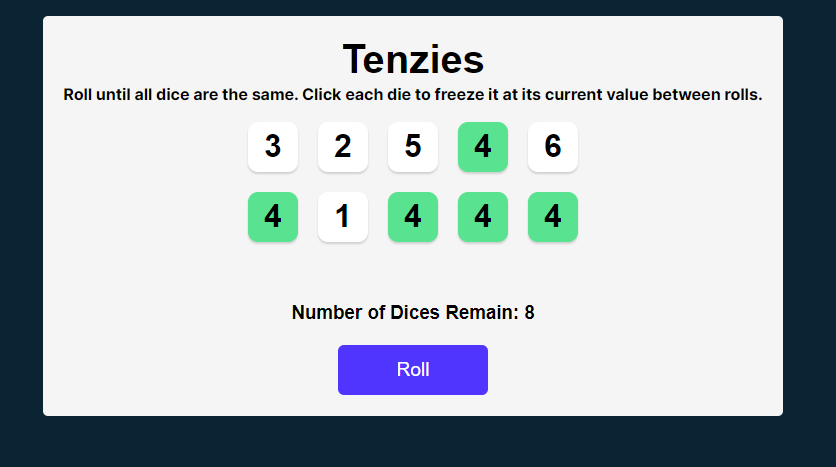

# Unit-Conversion-Extension

## Design After Completion: 

 

### Requirements:
- It should have Ten dices to roll.
- A button for rolling the dice.
- A nice Design the follow the UI design guidelines.
- Some useful functionalities like holding dices, change the color of hold dices and Cafetti when the user win the game.
- Logic: Keep number of dices to 10 and decrement it when user roll dice.

## Code
### HTML
Link: [Open HTML files in Editor](index.html)

### CSS 
Link: [Open CSS files in Editor](./src/App.css)

### JavaScript
Link: [Open JavaScript files in Editor](./src/App.jsx)
OR

 
## How this game works:

Refresh the game first.
The Game is design such that the user has to pick same dice number and roll the dice again. Each time the user roll dice, the number of dices will decrement by 1 and if the user hold all same dice before reaching zero number of dices to roll, the User Wins and vice versa.

## What I learnt in the Project:
- Basics of React.
- How to use React.useState
- How to handle React.useEffect.
- How to setup react app with vite and also to deploy it.
- Conditonal Rendering and all basic concepts.
- npm commands.
